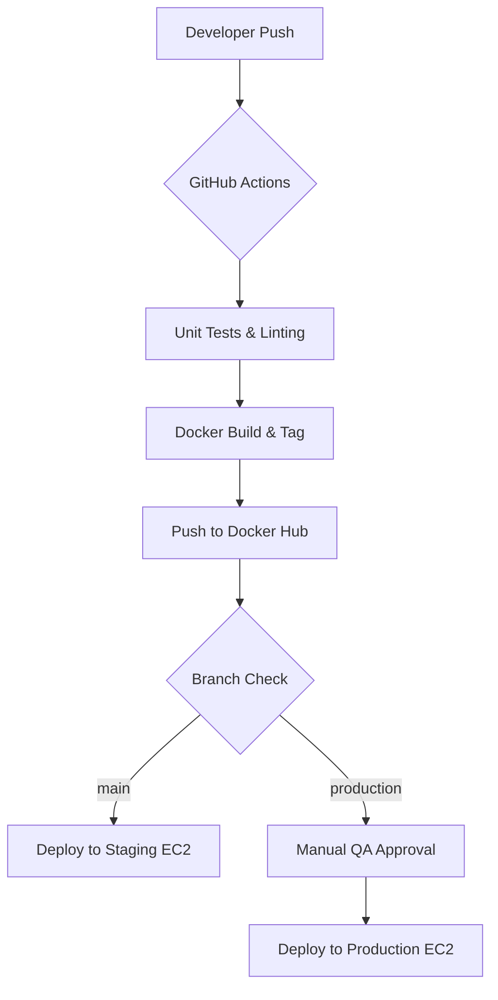

# Production-Grade Node.js CI/CD Pipeline

   

> This repository demonstrates a highly available and secure deployment architecture for Node.js microservices. Moving beyond a simple script, this project implements industry-standard DevOps patterns, focusing on **Immutable Infrastructure** and **Environment Parity**.

---

## 🏗️ Architectural Overview

The system is designed to minimize human error and maximize deployment reliability through a structured **4-stage pipeline**:

1. **Continuous Integration** — Automated linting and unit testing on every Push/PR.
2. **Containerization** — Multi-stage Docker builds to keep images lightweight and secure.
3. **Registry Management** — Versioned image tagging using Git SHAs to prevent `latest` tag pollution.
4. **Continuous Deployment** — Automated SSH-based deployment to AWS EC2 (Ubuntu) with distinct Testing and Production environments.

---

## 🚀 Key Engineering Features

### 1. Immutable Deployment Pattern

Every build generates a unique Docker image tag (`production-<SHA>`). This ensures that the exact code tested in Staging is what reaches Production, allowing for **instantaneous rollbacks** if a regression is detected.

### 2. Security Hardening

- **Secret Management:** Zero hardcoded credentials. All AWS and Docker Hub keys are managed via GitHub Actions Secrets.
- **Principle of Least Privilege:** EC2 security groups are restricted to essential traffic, and Docker containers are configured for non-root execution.
- **SSH Isolation:** Deployment is handled via encrypted SSH keys with automated cleanup post-deployment.

### 3. Environment Parity & QA Gates

- **Staging/Testing:** Automated deploy on every push to the `main` branch.
- **Production:** Protected deployment path requiring a **Manual Approval Gate**, simulating a SOC2-compliant enterprise workflow.

---

## 🛠️ Technical Stack

| Layer | Technology |
|---|---|
| Runtime | Node.js (v18+) — Optimized for Event Loop performance |
| Containerization | Docker (Multi-stage builds) |
| Orchestration | Docker Compose for localized service management |
| Cloud | AWS EC2 (t2.micro / t3.medium) |
| Automation | GitHub Actions (Custom YAML workflows) |

---

## 📊 Deployment Flow



---

## 🚦 Getting Started

### 1. Local Development

```bash
git clone https://github.com/hannu1992/nodejs-githubactions-ec2.git
cd nodejs-githubactions-ec2
docker build -t node-app-local .
docker run -p 3000:3000 node-app-local
```

### 2. CI/CD Configuration

To replicate this pipeline, configure the following secrets in your GitHub Repository:

| Secret | Description |
|---|---|
| `DOCKER_HUB_USERNAME` | Your Docker Hub username |
| `DOCKER_HUB_ACCESS_TOKEN` | Docker Hub access token |
| `EC2_SSH_KEY` | Private SSH key for EC2 access |
| `EC2_HOST` | Public IP of your EC2 instance |

---

## 📈 Future Roadmap

- [ ] Transition from standalone EC2 to **AWS EKS (Kubernetes)** for auto-scaling.
- [ ] Integrate **Prometheus & Grafana** for real-time Node.js performance monitoring.
- [ ] Implement **Canary Deployments** to reduce blast radius of new releases.

---

## 💡 Why I Built This

As a Senior Engineer, I believe that **deployment is as important as development**. This project serves as a blueprint for small-to-medium scale applications to achieve enterprise-level reliability with minimal overhead.
